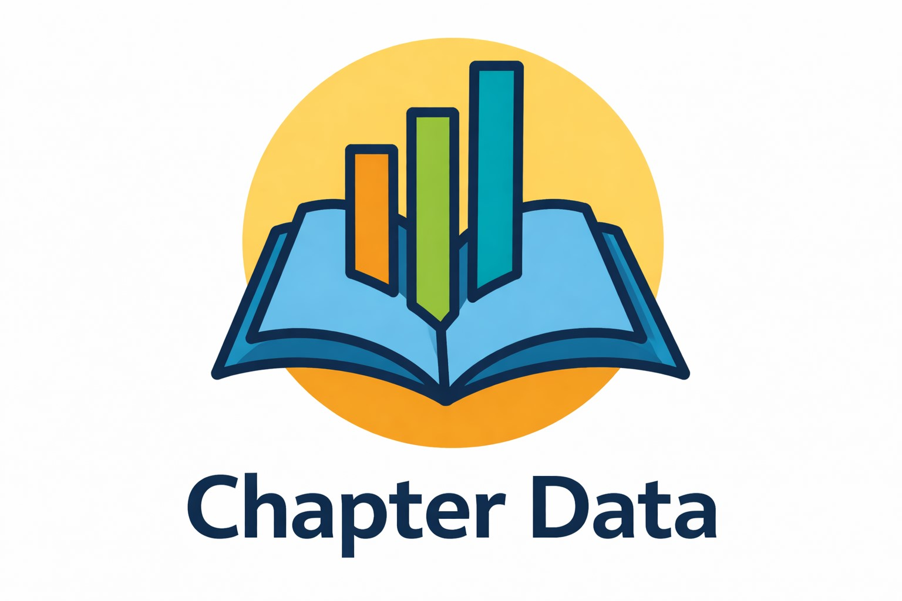

<!-- OnisaDev — GitHub Profile README -->

<div align="center">

# ✦ OnisaDev ✦
### Mari C. Pastor · DAM Graduate · Málaga 📍


```
// Junior Dev · Full-Stack · Data Analysis
// 16 años en farmacia → pivot a tech 💊→💻
```

[](mailto:mcpt1989@gmail.com)

</div>

---

## 🛠️ Stack

[](https://skillicons.dev)


---

## 🚀 Proyectos

### 📚 [Chapter Data](https://github.com/OnisaDev/Chapter-Data)
> App web full-stack para registro personal de lecturas.



Autenticación segura con bcrypt, gestión CRUD completa de libros con 16 géneros literarios y estadísticas visuales con gráficos. Proyecto final del ciclo DAM.

`Python` `FastAPI` `SQLAlchemy` `React` `Vite` `MySQL` `bcrypt` `Recharts`

---

### ⚽ [Futbol-Webapp](https://github.com/OnisaDev/Futbol-Webapp)
> Web app temática de fútbol desarrollada durante prácticas en Datacontrol Tecnología.

Framework de navegación avanzado con DDO relationships, editor de relaciones N:M jugador-posición y theming CSS personalizado.

`DataFlex 25.x` `CSS` `SQL` `Git`

---

### 🔐 [local_emoji2fa](https://github.com/OnisaDev/Moodle-plugin-motivacion)
> Plugin Moodle custom: autenticación 2FA basada en emojis.

Periodos de gracia por sesión, implementado con hooks de Moodle, event observers y base de datos propia. Desarrollado en prácticas en Datacontrol.

`PHP` `Moodle` `MySQL`

---

## 🔭 Ahora mismo

- 📖 Preparando **DP-900** Azure Data Fundamentals
- 🌍 Estudiando inglés técnico → **TOEIC B2**
- 💼 Buscando primer rol tech en **Málaga o remoto**
- 📝 Escribiendo sobre tech en [LinkedIn](https://www.linkedin.com/in/mari-c-pastor-torres) cada semana

---

## 📜 Certificaciones en curso

| | Certificación |
|---|---|
| 🔵 | DP-900 Azure Data Fundamentals |
| 🟡 | TOEIC B2 English |
| 🟠 | DP-700 Fabric Data Engineer Associate |

---

## 🐍 Contribuciones


---

## 📬 Contacto

[](https://www.linkedin.com/in/mari-c-pastor-torres)
[](mailto:mcpt1989@gmail.com)

---

<div align="center">
<sub>16 años de experiencia en otra vida. Ahora construyo cosas. ☕</sub>
</div>
